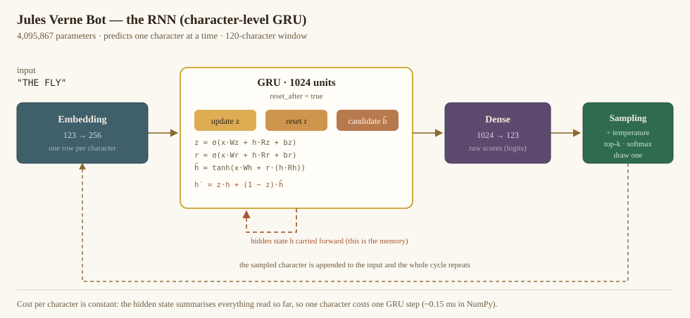
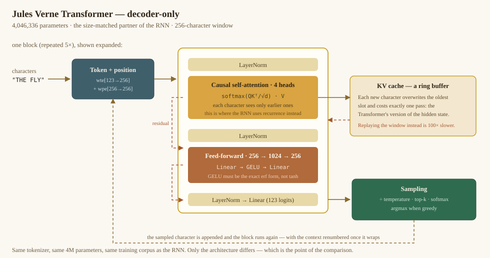
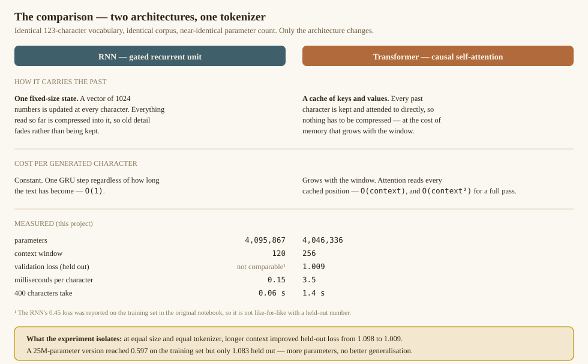

# Jules Verne Bot — RNN Text Generation Web App

A small web app for the **Generative AI** course: enter a word, set a temperature, and a
character-level recurrent neural network writes in the style of Jules Verne.

This serves the model trained in
`20_JulesVerneBot_Generating_English_Texts_with_RNN.ipynb` — the same Embedding → GRU →
Dense network, the same weights, the same 123-character vocabulary — as an interactive
page instead of a notebook cell.


---

## Live demo (GitHub Pages)

**The demo runs entirely in the browser** — no server, no TensorFlow.js, no CDN. The
weights are fetched as 16-bit binaries and the forward pass for both architectures is
implemented in plain JavaScript ES modules.

| | |
|---|---|
| Weights | 8.2 MB RNN + 8.1 MB Transformer (ctx 256) + 8.1 MB Transformer (ctx 120), float16 |
| Load order | RNN first (the page is usable in about a second), then the ctx-256 Transformer with a progress bar; the ctx-120 Transformer only when it is picked or the comparison needs it |
| Themes | Lamplight and Daylight, remembered per browser, following the system setting until you choose |
| Inference | ~2 ms/character for the RNN, ~8 ms for the Transformer |
| Dependencies | none |

See `docs/` for the page and `docs/assets/demo/js/` for the engines:

```
loader.js       fetch with progress, float16 -> float32, the (out, in) matrix contract
nn.js           erf-based GELU, layer norm, softmax, sigmoid
gru.js          the RNN
transformer.js  the Transformer, with the rebuilt KV cache
reflow.js       rejoining hard-wrapped lines (the twin of vernebot/text.py)
rng.js          seeded generator for the page
```

### Publishing

The workflow in `.github/workflows/pages.yml` uploads `docs/` to Pages on every push to
`main`. Enable it once under **Settings → Pages → Source: GitHub Actions**.

To preview locally, serve the folder over HTTP — ES modules will not load from
`file://`:

```bash
cd docs && python3 -m http.server 8099
```

### Regenerating the browser weights

After retraining, re-export and re-run the parity test:

```bash
python export_web_models.py
python tests/dump_python_reference.py
node tests/check_js_parity.mjs
```

`export_web_models.py` writes float16 blobs plus a manifest holding the vocabulary and
each tensor's shape and offset. The JavaScript never parses HDF5 and never transposes:
tensors are exported as `(out, in)`, so a linear layer is always `W @ x`.

**The large Transformer is not exported.** At 97 MB it exceeds GitHub's 100 MB per-file
limit and is far too much to hand a browser. It stays a Python-side model.

The three exported models are the ones the comparison rests on: the RNN, the Transformer
at the RNN's own 120-character window (the pair that isolates architecture), and the
Transformer at 256 (what a longer window buys). The demo's **Run all three** puts them
side by side on one seed.

### The browser port is verified, not assumed

`tests/check_js_parity.mjs` compares the JavaScript engines against the Python ones on
logits rather than on generated text — text is the wrong signal, because the browser
loads float16 weights and a single flipped near-tie changes every character after it.

| Check | Result |
|---|---|
| RNN logits, relative to the logit range | 0.0001 |
| Transformer logits, relative | 0.0002 |
| Top-8 characters, and the argmax | identical for both |
| Coherence past the window | 96.9% of the words written past it are in the corpus (fails below 85%) |
| Reflow, 12 cases | byte-identical to `vernebot/text.py` |

The coherence check is there because length alone said nothing: the test used to pass on
output that had already collapsed into word salad. Measured, the wrapping cache scored
54% and the rebuilt one 97%.

Five bugs were found this way, and four of them produced text plausible enough to look
finished. Three are worth knowing about because they are easy to reintroduce:

- **GELU must be the exact erf form, not the tanh approximation.** The tanh form is 5x
  faster on a 1024-element vector but the whole model only gets 5% faster, and the
  approximation is systematically biased, so five residual layers compound it. Measured
  against PyTorch, tanh drifts to 0.048% by a 20-character prompt while erf stays at
  0.0000%. The Python engine had been using tanh for serving — it no longer does.
- **The feed-forward bias goes before the activation, not after.** Adding it afterwards
  looks almost right and shifts the entire MLP branch.
- **The KV cache must not wrap.** With learned absolute positions, the newest character
  would take the oldest slot and so the lowest position, and the model would read a
  rotated window. The cache is rebuilt every 64 characters instead; see
  [EXPERIMENT.md](EXPERIMENT.md).

---

## The three models

The project trains and serves **two architectures on one tokenizer**, with the
Transformer at two window sizes, so they can be compared fairly: the same 123-character
vocabulary, the same ten novels, and — this is the part that makes the comparison mean
something — a near-identical parameter count.

The middle column is the one that isolates the architecture: same size *and* same window
as the RNN. The third adds a longer window on top, and the difference between the two
Transformers is what context length alone buys.

| | RNN | Transformer (matched) | Transformer (ctx 256) |
|---|---|---|---|
| Parameters | 4,095,867 | 4,011,520 | 4,046,336 |
| Context window | 120 | 120 | 256 |
| Validation loss (held out) | 1.146 | **1.102** | **1.034** |
| Milliseconds per character | 0.15 | 5.8 | 8.1 |

All three are trained on the same cleaned corpus and evaluated on the same held-out
slices, so the numbers are directly comparable. Each was run with three seeds; the
RNN-to-Transformer gap of 0.044 is about 22x the seed-to-seed standard deviation.

All three are in the browser demo, and **Run all three** puts them on one seed.

### The RNN

A character-level GRU. One fixed-size hidden state carries everything read so far, which
is why its cost per character is constant no matter how long the text becomes.



### The Transformer

Decoder-only, pre-norm, five layers, four heads, learned absolute positions and a
weight-tied output head. Instead of compressing the past into a state, it keeps every
past character's keys and values and attends to them directly.



### Side by side



The full experiment design, the measured costs and the honest caveats are in
**[EXPERIMENT.md](EXPERIMENT.md)**. In short: at equal size and an equal 120-character
window, attention beats recurrence by 0.044 nats per character (1.102 against 1.146);
widening the window to 256 characters buys a further 0.068, so **context length matters
more here than the architecture change does**. The RNN's validation loss bottoms out at
epoch 10 of 30 and rises afterwards, which is what the notebook's 0.45 training loss was
hiding.

---

## Quick start

```bash
cd /path/to/Jules_Verne
source .venv/bin/activate          # already created; see "Fresh install" if missing
python run.py
```

Your browser opens at **http://127.0.0.1:8000**. Press `Ctrl+C` to stop.

Useful flags:

```bash
python run.py --port 8080          # different port
python run.py --host 0.0.0.0       # share with students on the same network
python run.py --no-browser         # do not open a browser window
python run.py --reload             # auto-reload while editing the app
```

### Fresh install

```bash
python3.12 -m venv .venv
source .venv/bin/activate
pip install -r requirements.txt
python run.py
```

Only `numpy`, `h5py`, `fastapi` and `uvicorn` are needed. **TensorFlow is not required** —
see [Why no TensorFlow](#why-no-tensorflow) below.

---

## How to use the page

| Control | What it does |
| --- | --- |
| **Seed word or phrase** | The text the model continues. It writes character by character, so it continues your text rather than answering it. Characters outside the vocabulary are ignored. |
| **Temperature** | Divides the logits before sampling. `0.1` is cautious and repetitive, `0.7` is balanced, `1.0+` is strange and adventurous. |
| **Length** | How many characters to generate (100–3000). |
| **Greedy decoding** | Always take the most likely next character. Deterministic, ignores temperature and top-k, and quickly falls into loops — a clear classroom demonstration. |
| **Top-k** | Restrict sampling to the k most likely characters; the rest are masked. "off" lets the whole vocabulary compete. |
| **Random seed** | Fix it to reproduce a generation exactly, so two temperatures can be compared fairly. |
| **Rejoin wrapped lines** | On by default. The novels are hard-wrapped at about 67 characters and the model reproduces those breaks mid-sentence; this rejoins them into flowing paragraphs. Switch it off to see the raw character stream. |

Press **Enter** in the seed box to generate, or use the **Generate** button beside it.

Two extras worth knowing:

- **Compare Temperatures** runs the same seed at T = 0.5, 0.7 and 1.0 side by side. This is
  usually the most persuasive slide in a lecture.
- **Deep links**: the URL carries the whole configuration, so a demonstration can be
  bookmarked or pasted into slides:

  ```
  http://127.0.0.1:8000/?seed=THE%20MOON&temperature=1.0&length=1200&run=1
  ```

  Supported keys: `seed`, `temperature`, `length`, `top_k`, `greedy=1`, `seed_value`,
  `reflow=0` (show raw wrapping), `advanced=1`, `run=1` (generate immediately).

### Command line, without the browser

```bash
python generate_cli.py "THE FLYING SUBMARINE"
python generate_cli.py "CAPTAIN NEMO" --temperature 0.5 --length 1500
python generate_cli.py "THE MOON" --greedy
python generate_cli.py "MY UNCLE" --temperatures 0.5 0.7 1.0 --length 400
python generate_cli.py "THE MOON" --raw        # keep the model's hard wrapping
```

### Why the text looks wrapped

The training text is Project Gutenberg's plain-text editions, which break prose lines at
roughly 67 characters and separate paragraphs with a blank line. A character-level model
learns that pattern faithfully, so its raw output breaks mid-sentence:

```
He recalled upon the coast, though only at the same difficulty chattered
with packeter round the Seas of Torres Snowy. It was the reason why the
original remains of the shore, the silence was in procession.
```

`vernebot/text.py` rejoins single newlines into spaces while preserving the blank lines
that mark real paragraph breaks, so the page reads as flowing prose. It only moves
whitespace — no words are changed — and it is applied at display time, so the model's
actual output is always available by turning the option off. This is a nice teaching
moment in itself: it shows the model reproducing the *formatting* of its corpus, not just
its vocabulary.

---

## What is in this folder

```
run.py                  Launcher: starts the local server and opens the browser
generate_cli.py         Command-line text generation (no web server)
requirements.txt        numpy, h5py, fastapi, uvicorn
vernebot/
  engine.py             The RNN: weight loading, GRU forward pass, sampling
  transformer.py        The Transformer: KV-cache inference in pure NumPy
  transformer_model.py  Trainable PyTorch model + HDF5 export (training only)
  registry.py           Discovers models and serves them behind one interface
  text.py               Display post-processing (rejoining hard-wrapped lines)
train_transformer.py    Train a Transformer (CLI, also used by the notebook)
clean_corpus.py         Strips Gutenberg boilerplate: books/ -> books_clean/
export_transformer_onnx.py  Optional ONNX export (experimental, see its header)
app/
  main.py               FastAPI backend (REST API + static file serving)
  static/
    index.html          The page
    styles.css          Steampunk / 19th-century styling
    app.js              Front-end controller
docs/                   The static demo published to GitHub Pages
  index.html            The page
  assets/demo/          CSS, controller and the JavaScript inference engines
  assets/img/           Architecture diagrams (hand-written SVG)
  assets/models/        float16 weights + manifest for the browser
models/
  verne_rnn_model.keras The trained GRU model (weights only are read)
  tx-*.h5               Transformers, once trained (auto-discovered)
models_v2/              The retrained models: cleaned corpus, per-book split,
                        best-validation checkpoints, plus seeds/ and run logs
export_web_models.py    Exports models for the browser (float16 + manifest)
tests/                  Python/JavaScript parity: logits, generation, reflow
books/                  The ten novels, as downloaded; source of the vocabulary
books_clean/            The same novels without the Gutenberg boilerplate
                        (generated by clean_corpus.py; the training text)
20_JulesVerneBot_...ipynb          The 2024 course notebook, kept unchanged
Train_JulesVerne_RNN.ipynb         Retrains the GRU on the shared split (Colab)
Train_JulesVerne_Transformer.ipynb The Transformer training notebook (Colab)
EXPERIMENT.md           The RNN-vs-Transformer experiment design, for the lecture
```

---

## Comparing the RNN against a Transformer

The app serves **both architectures side by side**. It discovers every `*.keras`
and `*.h5` in `models/` and offers them in a selector, with a **Compare all
models** button that runs the identical seed, temperature and sampler across all
of them.

The design of that comparison matters more than the code. The short version:
**tokenization is held fixed and only architecture and scale are varied**, so
each claim is defensible on its own.

| Run | Parameters | vs RNN | Context | Val loss | Varies |
|---|---|---|---|---|---|
| RNN (`rnn-split`) | 4,095,867 | 1.00x | 120 | 1.146 | baseline |
| `tx-paired-ctx120` | 4,011,520 | 0.98x | 120 | 1.102 | **architecture only** |
| `tx-paired` | 4,046,336 | 0.99x | 256 | 1.034 | architecture + context |
| `tx-large` | 25,414,144 | 6.20x | 256 | not retrained | **scale** |

At a 2% parameter difference and an identical window, the second row against the
first isolates attention versus recurrence. `tx-large` still needs retraining on
the cleaned corpus and the per-book split; its earlier number was measured on
different data. Full reasoning, measured costs and the
correctness checks are in **[EXPERIMENT.md](EXPERIMENT.md)**.

### The corpus, and the split both architectures share

`clean_corpus.py` writes `books_clean/`: the ten novels with the Project Gutenberg
header and license removed (3.4% of the raw text — enough that the original RNN
learned to recite the license). The vocabulary is still built from the raw
`books/`, so it stays at 123 characters and every model remains token-compatible.

Validation holds out a contiguous 5% from the **middle of each book**, 278,888
characters in all, and no training window crosses a book boundary or a held-out
slice. `python train_transformer.py --dump-split split/` writes that split as
text files.

```bash
python clean_corpus.py             # books/ -> books_clean/
python clean_corpus.py --check     # report only
```

### Training

Open `Train_JulesVerne_Transformer.ipynb` in Colab (Runtime → GPU) for the
Transformers, and `Train_JulesVerne_RNN.ipynb` for the RNN — the second retrains
the course GRU on exactly the same split, which is what makes the two
architectures comparable. Both clone the repo, generate `books_clean/`, train,
plot the loss curves and download the weights. Drop them in `models/` and restart
the app.

Both notebooks export the checkpoint with the **lowest validation loss**, not the
last step. This matters: the RNN's best epoch is 10 of 30, and its validation loss
is 8% worse by epoch 30.

`20_JulesVerneBot_Generating_English_Texts_with_RNN.ipynb` is kept unchanged as
the 2024 course record; it has no validation set.

The same thing from a shell:

```bash
python train_transformer.py --preset paired --context 120 --steps 6000 \
       --out models/tx-paired-ctx120.h5
```

Measured training cost (Apple M5 Max; a Colab T4 is comparable at this size):
the two size-matched runs are ~70 minutes together, the 25M model ~4 hours.

---

## API

The front end is a thin client over five endpoints, so the models are easy to use
from other code, from `curl`, or from a different UI.

```bash
curl http://127.0.0.1:8000/api/meta
```

```json
{
  "default_model": "verne_rnn_model",
  "default_temperature": 0.7,
  "default_num_generate": 800,
  "max_generate": 4000,
  "models": [
    {"key": "verne_rnn_model", "label": "RNN · GRU 1024", "architecture": "rnn"},
    {"key": "tx-paired", "label": "Transformer · matched, ctx 256",
     "architecture": "transformer"}
  ]
}
```

<details>
<summary>Older single-model response shape</summary>

The original `GET /api/meta` returned the metrics of the one model directly:

```json
{
  "vocab_size": 123,
  "parameter_count": 4095867,
  "context_length": 120,
  "model_file": "verne_rnn_model.keras",
  "default_temperature": 0.7,
  "default_num_generate": 800,
  "max_generate": 4000
}
```

</details>

Generate against a specific model, and compare several at once:

```bash
curl -X POST http://127.0.0.1:8000/api/generate \
  -H 'Content-Type: application/json' \
  -d '{"seed":"THE FLYING SUBMARINE","model":"tx-paired",
       "temperature":0.5,"num_generate":400,
       "top_k":null,"greedy":false,"seed_value":42,"reflow":true}'
```

```json
{
  "text": "THE FLYING SUBMARINE...",
  "seed": "THE FLYING SUBMARINE",
  "model": "tx-paired",
  "architecture": "transformer",
  "temperature": 0.5,
  "num_generate": 400,
  "top_k": null,
  "greedy": false,
  "seed_value": 42,
  "reflow": true,
  "elapsed_ms": 1520.3
}
```

```bash
curl -X POST http://127.0.0.1:8000/api/compare \
  -H 'Content-Type: application/json' \
  -d '{"seed":"THE MOON","models":["verne_rnn_model","tx-paired","tx-large"],
       "temperature":0.7,"num_generate":300,"seed_value":4}'
```

Each model in the comparison gets the same seed and temperature, and one model
failing does not fail the others — its result carries an `error` field instead.

| Endpoint | Method | Purpose |
| --- | --- | --- |
| `/` | GET | The web page |
| `/api/models` | GET | List available models and their limits |
| `/api/meta` | GET | Defaults plus the model list |
| `/api/generate` | POST | Generate text with one model |
| `/api/compare` | POST | Run one prompt across several models |
| `/api/health` | GET | Liveness check |
| `/docs` | GET | Interactive OpenAPI documentation (FastAPI) |

Invalid input is rejected with a `422` (bad temperature, empty seed, length over the
limit); a seed written entirely in characters the model never saw returns `400` with a
message naming the offending characters; an unknown `model` returns `404` listing the
available keys.

Note that Transformers are capped at **1,500 characters per request**, because the
pure-NumPy engine costs about 4 ms per character against the RNN's 0.1 ms.

---

## Why no TensorFlow (or PyTorch) at serving time

The trained weights are plain HDF5 — inside the `.keras` archive for the RNN, and as
a standalone `.h5` for the Transformers. The serving path reads those arrays directly
and reimplements both architectures in NumPy:

```
RNN          Embedding(123→256) → GRU(1024, reset_after=True) → Dense(123)
Transformer  Embedding + positions → 5 × [LN, attention, LN, MLP] → LN → tied head
```

This buys three things that matter for a classroom:

1. **No heavy dependency.** Installing TensorFlow or PyTorch is slow and fragile;
   `numpy` + `h5py` are neither. The app starts in well under a second. (PyTorch is
   still used *for training* — see `train_transformer.py` — just not for serving.)
2. **Speed.** Each generated character costs one GRU timestep, about **0.1 ms**, because
   the hidden state is carried forward. A 1000-character generation takes roughly 60 ms
   end to end including the HTTP round trip.
3. **Transparency.** The recurrence is ten lines of readable arithmetic, which is exactly
   the point of the exercise. There is no framework hiding the maths.

### Correctness

The NumPy forward pass was verified against Keras on the saved model: logits agree to
within **5 × 10⁻⁵** (float32 round-off), and top-1 next-character accuracy on held-out
text is **72%**.

One detail is worth teaching, because getting it wrong silently produces gibberish:
Keras' `reset_after=True` GRU applies the reset gate **after** the recurrent matrix
multiply —

```python
z = sigmoid(x @ Wz + h @ Rz + bz + rbz)
r = sigmoid(x @ Wr + h @ Rr + br + rbr)
hh = tanh(x @ Wh + bh + r * (h @ Rh + rbh))
h_next = z * h + (1 - z) * hh
```

— and the recurrent bias `rb*` applies to **all three** gates, not only the candidate.
An early version of this engine used the more common `(r * h) @ Rh` ordering and produced
plausible-looking nonsense; the difference is visible in the code and documented in
`gru_step`.

### Vocabulary

The notebook derived its character vocabulary with `sorted(set(text))` over the ten books
concatenated. That mapping is not stored in the `.keras` file, so the app rebuilds it from
`books/` at startup and **checks** that it matches the model's expected input dimension
(123), failing loudly rather than generating noise if the books change. Keep `books/`
alongside `run.py`.

The Transformer exports **do** store their vocabulary, architecture config, parameter
count and validation loss inside the `.h5`, so a trained Transformer is self-describing
and can be dropped into `models/` with no further information.

### The Transformer engine

`vernebot/transformer.py` is verified against PyTorch: logits agree to **8 × 10⁻⁸** and
greedy generation matches **token for token** over 123 tokens. Two things there are worth
reading for the lecture:

- **KV cache.** Each step stores one token's keys and values instead of recomputing the
  window. This is the Transformer's version of the RNN's carried hidden state.
- **The window slides, and the cache cannot simply wrap.** With learned absolute
  positions, a cached token carries the position it was written with. Letting the ring
  wrap gives the newest character the *oldest* slot and therefore a low position, so the
  model reads a cyclic rotation of the text. That was a real bug here: generation
  collapsed into word salad within a few dozen characters of the window filling, on the
  site and in the app.
- **So the cache is rebuilt instead.** Generation appends while there is room; when the
  window fills, the oldest 64 characters are dropped and the rest are recomputed at their
  new positions, freeing 64 slots. One window pass per 64 characters, against one per
  character for a full replay.

| `tx-paired`, 600 characters | ms per character | Real words past the window |
|---|---|---|
| Wrapping ring (old behaviour) | 3.5 | ~50% |
| Rebuilt every 64 characters | 9.5 | ~98% |
| Full replay | ~330 | ~98% |

The prompt is also limited to `context - 1` characters, reserving one slot, so the first
generated token never lands on a position a prompt token already used.

`tests/check_js_parity.mjs` measures this instead of assuming it: it generates past the
window and fails if fewer than 85% of the words are in the corpus. Rotary or relative
positions would make a true sliding window valid and remove the rebuild, at the price of
retraining.

---

## Configuration

| Variable | Effect |
| --- | --- |
| `VERNE_MODELS_DIR` | Directory to scan for models (default `models/`). |
| `VERNE_BOOKS_DIR` | Derive the vocabulary from a different folder. |
| `VERNE_MODEL_PATH` | Legacy: force a single `.keras` model. |

To add a model, put the file in `models/` and restart. `*.keras` is treated as the RNN,
`*.h5` as a Transformer, and the app labels known filenames (`tx-paired`,
`tx-paired-ctx120`, `tx-large`) with friendly names.

---

## Known limitations (useful for the lecture)

- **120-character context.** The model was trained on fixed 120-character windows and has
  no attention, so it holds local grammar and phrasing but loses the thread of a long
  narrative. Output drifts, and repetitions appear.
- **No prompt obedience.** This is a character-level language model, not an instruction-
  following assistant. It continues text; it does not answer questions.
- **Sampling loops.** Low temperature and greedy decoding converge on safe, repetitive
  phrases; higher temperature escapes them but damages coherence. That trade-off is the
  temperature control made visible.

These are the same points the notebook makes when bridging from this model to modern
transformer LLMs.

---

## Credits

Original notebook and model by **Marcelo Rovai**. The web app, the browser demo, the
Transformer comparison and the training scripts were generated by **Claude Opus 5**
(Anthropic) under his direction; the 2024 course notebook had code support from Claude
3.5 Sonnet and ChatGPT 4o. Training texts from [Project Gutenberg](https://www.gutenberg.org/).
